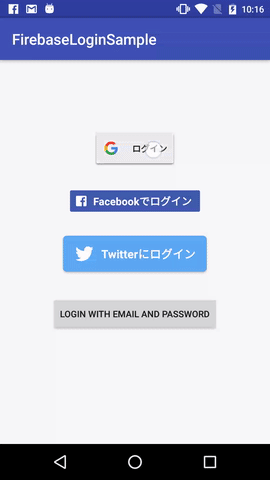

This Android application is sample application for [Qiita Advent Calendar Day 17th](http://qiita.com/ronnnnn/items/dddf57a0369f780d8ac2).

# Demo

# Description
This application implemented Firebase Authentication with Google, Facebook, Twitter and Email.

If you want to know about this application more, read code or visit [here](http://qiita.com/ronnnnn/items/dddf57a0369f780d8ac2).

Please make issues or pull requests when you find some problems in this app.

Thank you.

# References
- [Firebase Documentations](https://firebase.google.com/docs/)
- [Firebase Authentication Documentations](https://firebase.google.com/docs/auth/)
- [Google Sign-In for Android](https://developers.google.com/identity/sign-in/android/sign-in)
- [Facebook Login Documentations](https://developers.facebook.com/docs/facebook-login/android)
- [Twitter Developer Documentations](https://dev.twitter.com/web/sign-in/implementing)
- [Fabric Documentations](https://docs.fabric.io/android/twitter/log-in-with-twitter.html)